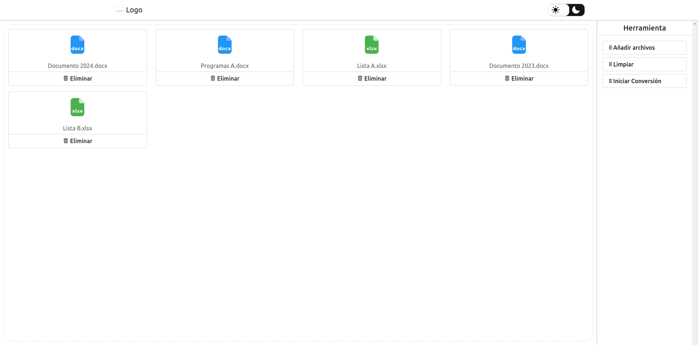
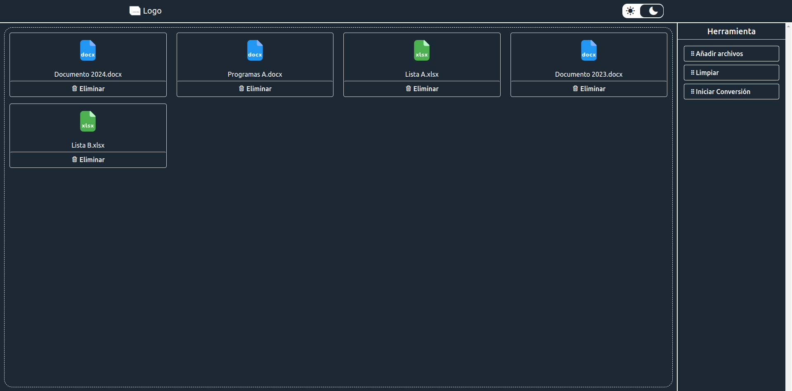

# Sistema Web para Convertir Archivos Office a PDF

Este es un sistema web de código abierto que permite convertir archivos de Office (Word, Excel, PowerPoint) a PDF de manera rápida y sencilla. El sistema web se desarrolló con PHP, JavaScript, CSS y Bootstrap 5, utilizando la API de iLoveAPI para la conversión de archivos.




## Contenidos

- [Contribuciones](#contribuciones)
- [Instalación](#instalación)
- [Licencia](#licencia)
- [Contacto](#contacto)

## Contribuciones

Las contribuciones son siempre bienvenidas. Si deseas contribuir, siéntete libre de contribuir en este repositorio. Cualquier contribución que hagas será muy apreciada.

Acepto contribuciones relacionadas con la mejora de funcionalidades, corrección de errores y nuevas ideas. No se aceptarán cambios que afecten negativamente la integridad del proyecto.

Si tienes alguna sugerencia que pueda mejorar esto, crea un fork del repositorio y una solicitud de incorporación de cambios. También puedes abrir un problema con la etiqueta "mejora". ¡No olvides darle una estrella al proyecto! ¡Gracias de nuevo!

1. **Haz un Fork del Proyecto**
    - Ve al repositorio y haz un fork para crear una copia del proyecto en tu cuenta de GitHub.

2. **Crea una Rama para tu Funcionalidad**
    - Crea una nueva rama para la funcionalidad que desees agregar o el error que quieras corregir. El nombre de la rama debe estar en inglés y seguir la convención `feature/nombre-de-la-funcionalidad` para nuevas funcionalidades o `bugfix/nombre-del-error` para correcciones de errores. Por ejemplo:

        ```bash
        git checkout -b feature/new-dashboard
        ```
        o

        ```bash
        git checkout -b bugfix/fix-login-issue
        ```

3. **Realiza los Cambios**
    - Realiza los cambios necesarios en el código o agrega nuevas funcionalidades.

4. **Haz Commit de tus Cambios**
    - Después de realizar los cambios, confirma los mismos con un mensaje claro que explique lo que se ha modificado:

        ```bash
        git commit -m 'Agregar nueva funcionalidad para el dashboard'
        ```

5. **Sube tus Cambios**
    - Sube tus cambios a tu repositorio de GitHub:
    
        ```bash
        git push origin feature/new-dashboard
        ```

6. **Abre un Pull Request**
    - Abre un Pull Request para que pueda revisar tus cambios. Asegúrate de describir brevemente lo que has cambiado.

## Instalación

Sigue estos pasos para instalar y configurar el sistema web de conversión de archivos:

1. **Clonar el repositorio**

    ```bash
    git clone https://github.com/iadataweb/master-web-office-to-pdf-converter.git
    ```

2. **Configurar la base de datos**
    - Crea una nueva base de datos en tu servidor MySQL llamada `db-web-office-to-pdf-converter`.
    - Ve a la carpeta 'database' y abre el archivo `db-web-office-to-pdf-converter.sql`.
    - Copia el contenido del archivo.
    - Abre phpMyAdmin, selecciona la base de datos `db-web-office-to-pdf-converter` y dirígete a la pestaña SQL.
    - Pega la consulta copiada en el editor de SQL y haz clic en Continuar para crear las tablas y registros iniciales.

3. **Configurar el archivo de conexión**
    - Ingresa en la carpeta `config` y abre el archivo `system.example.php`.
    - Completa los valores con la configuración real del sistema.
    - Genera tu clave pública y privada en la página web de [iloveapi](https://www.iloveapi.com) y añade estas claves en el archivo `config`.
    - Renombra el archivo llamado `system.example.php` a `system.php`.

5. **Ejecutar el servidor**
    - Inicia tu servidor web local (por ejemplo, XAMPP o WAMP) y asegúrate de que el servicio MySQL esté corriendo.
    - Accede a la aplicación a través de tu navegador en `http://localhost/master-web-office-to-pdf-converter`.

¡Listo! Ahora deberías poder utilizar el sistema web Libre.

## Licencia

El proyecto es de código abierto bajo la licencia MIT. Puedes ver más detalles en el archivo [LICENSE](LICENSE).

## Contacto

Carlos Injante - [LinkedIn](https://www.linkedin.com/in/20ismael1999/)

<p align="center">¡Gracias por visitar mi proyecto!</p>